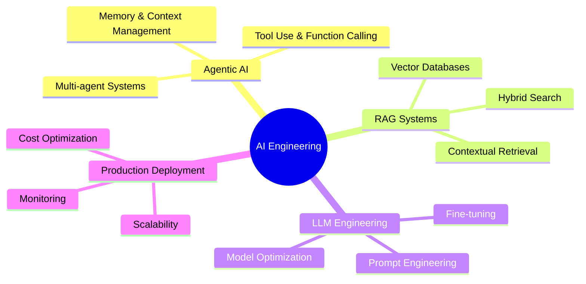

<div align="center">

<!-- Animated Header with 3D Effect -->


<!-- 3D Animated Typing SVG -->
<a href="https://git.io/typing-svg"></a>

<br/>

<!-- Animated Badges -->
<p align="center">
  
  
  
  
</p>

<!-- Animated GIF or Image -->


</div>

---

## 🚀 About Me

```python
class AIEngineer:
    def __init__(self):
        self.name = "Muhammad Anas"
        self.role = "AI Engineer & Agentic AI Specialist"
        self.location = "Pakistan 🇵🇰"
        self.focus = ["Agentic AI", "RAG Systems", "LLM Engineering"]
        self.currently_building = "Autonomous AI Agents for Real-World Applications"
    
    def say_hi(self):
        print("Thanks for visiting! Let's build the future of AI together!")

me = AIEngineer()
me.say_hi()
```

<div align="center">

## 💻 Tech Stack & Tools

### AI/ML Frameworks

<p align="center">
  
  
  
  
  
</p>

### Development Tools

<p align="center">
  
  
  
  
  
</p>

### Databases & Vector Stores

<p align="center">
  
  
  
  
</p>

</div>

---

## 💡 What I'm Building

<table>
<tr>
<td width="50%">

### 🎓 Classroom Suite MCP
> AI-powered education tools with Google Workspace integration

- 🤖 Intelligent tutoring system
- 📊 Auto-grading with AI feedback
- 📅 Smart scheduling assistant

</td>
<td width="50%">

### 📚 Class Mate AI
> Your intelligent study companion

- 📝 Note-taking automation
- 🎯 Personalized learning paths
- 🗣️ Voice-activated queries

</td>
</tr>
<tr>
<td width="50%">

### 🧠 RAG Chat Systems
> Advanced retrieval-augmented generation

- 🔍 Semantic search engine
- 📊 Report analysis chatbot
- 📄 Document Q&A systems

</td>
<td width="50%">

### ✉️ Email Agent
> Autonomous email management

- 🤖 Smart auto-replies
- 📥 Inbox organization
- 📊 Priority detection

</td>
</tr>
</table>

---

<div align="center">

## 📈 GitHub Analytics

<!-- GitHub Stats Card with 3D Effect -->
<p align="center">
  
  
</p>

<!-- 3D Contribution Graph -->


<!-- GitHub Streak Stats -->
<p align="center">
  
</p>

<!-- GitHub Trophies -->
<p align="center">
  
</p>

</div>

---

## 🎯 2025 Focus Areas



---

<div align="center">

## 📡 Let's Connect!

<p align="center">
  <a href="https://www.linkedin.com/in/muhammad-anas-ai/">
    
  </a>
  <a href="https://github.com/anasdevai">
    
  </a>
  <a href="mailto:your.email@example.com">
    
  </a>
</p>

<br/>

<!-- Animated Footer with 3D Wave -->


### 💡 *"The future belongs to those who build intelligent systems that empower humanity."*


</div>
